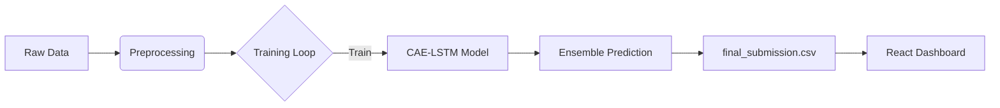

# Engine Health Monitoring System - Technical Report

## 1. System Overview
This project implements a Predictive Maintenance system for aircraft engines using the C-MAPSS dataset. It predicts the Remaining Useful Life (RUL) of engines based on sensor data using a **Convolutional Autoencoder LSTM (CAE-LSTM)** architecture.

The system consists of:
- **Data Pipeline**: Preprocessing, feature selection, and sliding window sequence generation.
- **Model**: A hybrid deep learning model combining CNN layers for feature extraction, LSTM for temporal sequencing, and Attention mechanisms.
- **Training**: An ensemble approach training multiple models for robust prediction.
- **Visualization**: A React-based dashboard to monitor engine status in real-time.

## 2. Architecture
The data flows from raw sensor logs to actionable insights on the dashboard.



## 3. Key Components

### A. Preprocessing (`preprocessing.py`)
The system treats RUL prediction as a regression problem but limits the maximum RUL to avoid "infinite" life predictions for healthy engines (Piecewise Linear RUL).

**Key Logic: Piecewise RUL**
```python
def calculate_rul_piecewise(df, early_rul=125):
    # Calculate actual RUL
    max_cycles = df.groupby('unit')['cycle'].max().reset_index()
    df = df.merge(max_cycles, on='unit', how='left')
    df['RUL'] = df['max_cycle'] - df['cycle']
    
    # Cap RUL at early_rul (e.g., 125 cycles)
    # This creates a flat plateau for healthy engines
    df['RUL'] = df['RUL'].clip(upper=early_rul)
    return df
```

### B. Model Architecture (`model.py`)
The model is sophisticated, using 1D Convolutions to extract local features from sensor time-series, followed by LSTM for long-term dependencies, and an Attention layer to focus on critical time steps.

**Snippet: CAE-LSTM Structure**
```python
def build_caelstm_model(input_shape):
    inputs = Input(shape=input_shape)
    
    # feature extraction
    e = Conv1D(filters=128, kernel_size=3, activation='relu', padding='same')(inputs)
    e = MaxPooling1D(pool_size=2, padding='same')(e)
    
    # Temporal capturing
    l = LSTM(128, return_sequences=True)(e)
    
    # Attention Mechanism (Simplified)
    att = tf.keras.layers.TimeDistributed(Dense(1, activation='tanh'))(l)
    att = Activation('softmax')(att)
    att_out = Multiply()([l, att])
    
    # Regression Head
    d = Dense(100, activation='relu')(att_out)
    outputs = Dense(1, activation='linear')(d)
    
    return Model(inputs=inputs, outputs=outputs)
```

### C. Training Pipeline (`train.py`)
The system uses an **Ensemble Approach**. Instead of relying on one model, it trains 5 independent models and averages their predictions. This reduces variance and improves generalization.

**Snippet: Ensemble Loop**
```python
n_models = 5
ensemble_preds = np.zeros((len(X_test), 1))

for i in range(n_models):
    print(f"Training Model {i+1}")
    model = build_caelstm_model(...)
    
    # Verbose=1 ensures we see progress bars
    model.fit(X_train, y_train, epochs=25, verbose=1, shuffle=True)
    
    # Accumulate predictions
    ensemble_preds += model.predict(X_test)

# Average results
ensemble_preds /= n_models
```

### D. Dashboard (`rul-dashboard/`)
The frontend is built with React and Vite. It polls `final_submission.csv` to display live status.

**Recent Fixes & Optimization:**
1.  **Frontend Sorting**: Explicitly sorts data by `Unit ID` to ensure the table is ordered correctly, regardless of CSV row order.
2.  **Layout Fixes**: Corrected CSS flexbox issues that were causing the top rows (Units #1-46) to be clipped or hidden off-screen.
3.  **Refreshed Data**: Implemented cache-busting `?t=${Date.now()}` to force the dashboard to load the newest prediction file.

## 4. Operational Guide
- **Start**: Run `start_system.bat`.
    - It configures the environment (GPU is auto-detected).
    - Runs training (`train.py`).
    - Launches the dashboard server.
- **Output**: `final_submission.csv` is generated and copied to the dashboard's public folder for display.
